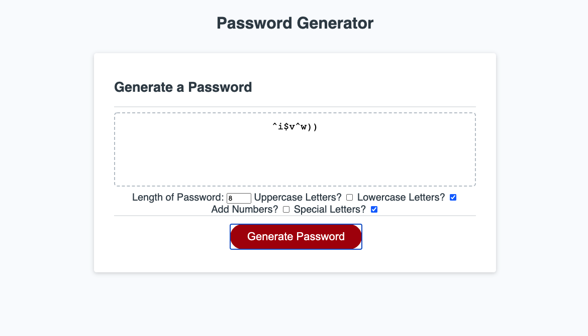

# **Password Generator (“password-generator_js”)**

## Table of Contents

* [Description](#description)
* [Requirements](#requirements)
* [Installation](#installation)
* [Contributing](#contributing)
* [Credits](#credits)

## Description
---
Included in this repository is refactored code to create a password generator. Most of the requirements for this refactor were done by utilizing Javascript, with slight modifications to the provided HTML and CSS code. 

Working through this refactor is a perfect way to understand how to utilize functions and for loops, as well as their purpose in code. It is easy to try and explain a set of statements that perform a task should make sense, but until you write and execute something yourself, it doesn’t always truly click.

Deployed Website: 



## Requirements 
---
```
GIVEN I need a new, secure password
WHEN I click the button to generate a password
THEN I am presented with a series of prompts for password criteria
WHEN prompted for password criteria
THEN I select which criteria to include in the password
WHEN prompted for the length of the password
THEN I choose a length of at least 8 characters and no more than 128 characters
WHEN prompted for character types to include in the password
THEN I choose lowercase, uppercase, numeric, and/or special characters
WHEN I answer each prompt
THEN my input should be validated and at least one character type should be selected
WHEN all prompts are answered
THEN a password is generated that matches the selected criteria
WHEN the password is generated
THEN the password is either displayed in an alert or written to the page
```

## Installation
---
No installation needed for this project

See deployed site here: https://haleighspurlock.github.io/password-generator_js/

See repository here: https://github.com/haleighspurlock/password-generator_js

## Contributing
---

Any and all improvement suggestions are welcome! 

Email: haleighspurlock@gmail.com

## Credits
---
Starter code provided by Trilogy Education Services

Haleigh Spurlock 2021